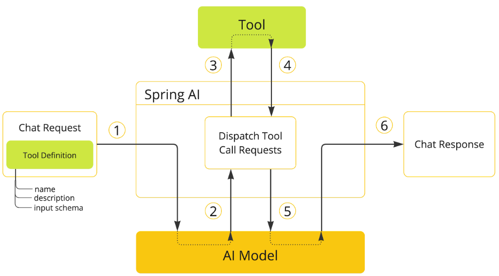

# Tool Calling

Spring AI 通过一组灵活的抽象支持工具调用，这些抽象允许以一致的方式定义、解析和执行工具



1. 当想让某个工具可供模型使用时，在 chat 请求中包含其定义。每个工具定义都包含输入参数的名称、描述和方案。
2. 当模型决定调用工具时，它会发送一个响应，其中包含工具名称和输入参数，这些参数在定义的架构之后建模。
3. 应用程序负责使用工具名称来识别和执行具有提供的输入参数的工具。
4. 工具调用的结果由应用程序处理。
5. 应用程序将工具调用结果发送回模型。
6. 该模型使用 tool call result 作为附加上下文生成最终响应。

## Methods as Tools

Spring AI 以两种方式为从方法指定工具（即 ToolCallback）提供了内置支持：
1. 声明方式使用`@Tool`注解
2. 编程方式，使用低级`MethodToolCallback`实现。

### 声明式

```java
public class DateTimeTools {
    @Tool(description = "Get the current date and time in the user's timezone")
    String getCurrentDateTime() {
        return LocalDateTime.now().atZone(LocaleContextHolder.getTimeZone().toZoneId()).format((DateTimeFormatter.ofPattern("yyyy-MM-dd HH:mm:ss")));
    }
}
```

#### 向 ChatModel 添加工具
使用声明性规范方法时，可以在调用 ChatClient 时将 tool 类实例传递给 tools() 方法。此类工具仅适用于它们被添加到的特定聊天请求。  
```java
ChatClient.create(chatModel)
    .prompt("What day is tomorrow?")
    .tools(new DateTimeTools())
    .call()
    .content();
```
在后台，ChatClient 将从工具类实例中的每个 @Tool 注释方法生成一个 ToolCallback，并将它们传递给模型。也生成 ToolCallback，则可以使用 ToolCallbacks 实用程序类。
```java
ToolCallback[] dateTimeTools = ToolCallbacks.from(new DateTimeTools());

// 声明式的添加工具
ChatModel chatModel = ...
ChatClient chatClient = ChatClient.builder(chatModel)
    .defaultTools(new DateTimeTools())
    .build();

ChatModel chatModel = ...
ToolCallback[] dateTimeTools = ToolCallbacks.from(new DateTimeTools());
ChatOptions chatOptions = ToolCallingChatOptions.builder()
    .toolCallbacks(dateTimeTools)
    .build();
Prompt prompt = new Prompt("What day is tomorrow?", chatOptions);
chatModel.call(prompt);
```
### 编程式

通过以编程方式构建 MethodToolCallback 将方法转换为工具

MethodToolCallback.Builder 允许您构建 MethodToolCallback 实例并提供有关该工具的关键信息

```java
public class ProgrammaticTools {
    String getCurrentDateTime() {
        return LocalDateTime.now().atZone(LocaleContextHolder.getTimeZone().toZoneId()).format((DateTimeFormatter.ofPattern("yyyy-MM-dd HH:mm:ss")));
    }
}
```

#### 向 ChatModel 添加工具


```java
Method method = ReflectionUtils.findMethod(DateTimeTools.class, "getCurrentDateTime");
// 添加失败
ToolCallback toolCallback = MethodToolCallback.builder()
    .toolDefinition(ToolDefinition.builder(method)
            .description("Get the current date and time in the user's timezone")
            .build())
    .toolMethod(method)
    .toolObject(new DateTimeTools())
    .build();
```


## Function as Tools

Spring AI 为从函数指定工具提供了内置支持，既可以使用低级 FunctionToolCallback 实现以编程方式指定工具，也可以动态地作为运行时解析 @Bean。

### 编程规范

可以通过以编程方式构建 FunctionToolCallback，将函数类型（Function、Supplier、Consumer 或 BiFunction）转换为工具。

```java
public class WeatherService implements Function<WeatherRequest, WeatherResponse> {
    public WeatherResponse apply(WeatherRequest request) {
        return new WeatherResponse(30.0, Unit.C);
    }
}

public enum Unit { C, F }
public record WeatherRequest(String location, Unit unit) {}
public record WeatherResponse(double temp, Unit unit) {}


ToolCallback toolCallback = FunctionToolCallback
        .builder("currentWeather", new WeatherService())
        .description("Get the weather in location")
        .inputType(WeatherRequest.class)
        .build();
```

### 动态规范
可以将工具定义为 Spring bean，并让 Spring AI 在运行时使用 ToolCallbackResolver 接口（通过实现） SpringBeanToolCallbackResolver 动态解析它们，而不是以编程方式指定工具。此选项使可以使用任何 Function、Supplier、Consumer 或 BiFunction bean 作为工具。bean 名称将用作工具名称，Spring Framework 中的 @Description 注释可用于提供工具的描述，模型使用它来了解何时以及如何调用该工具。如果您未提供描述，则方法名称将用作工具描述。但是，强烈建议提供详细的描述，因为这对于模型了解工具的用途以及如何使用它至关重要。未能提供良好的描述可能会导致模型在应该使用该工具时未使用该工具或错误地使用该工具。
```java
@Configuration
public class DynamicTools {
    @Bean
    @Description("Get the weather in location")
    Function<WeatherRequest, WeatherResponse> getWeather() {
        return (request) -> {
            return  new WeatherResponse(37.9, Unit.C);
        };
    }

    record WeatherRequest(@ToolParam(description = "The name of a city or a country") String location, Unit unit) {
    }

    public enum Unit {C, F}

    public record WeatherResponse(double temp, Unit unit) {
    }
}

```